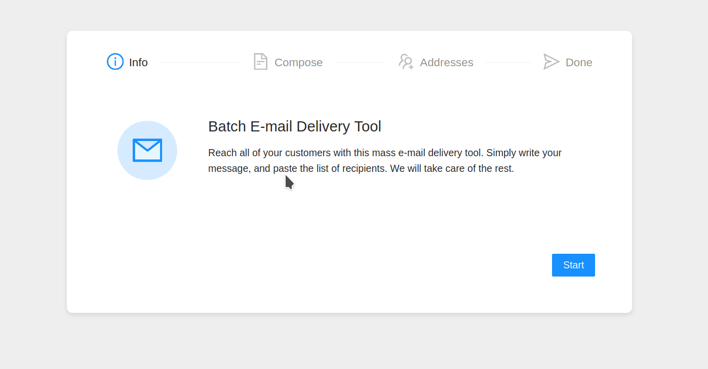
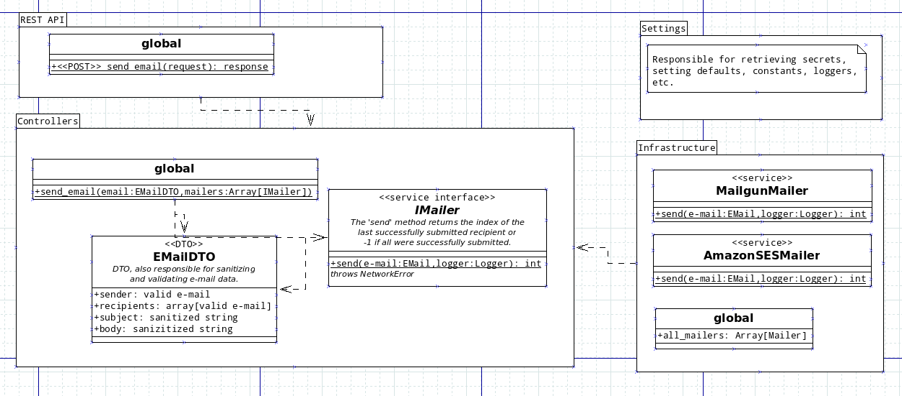
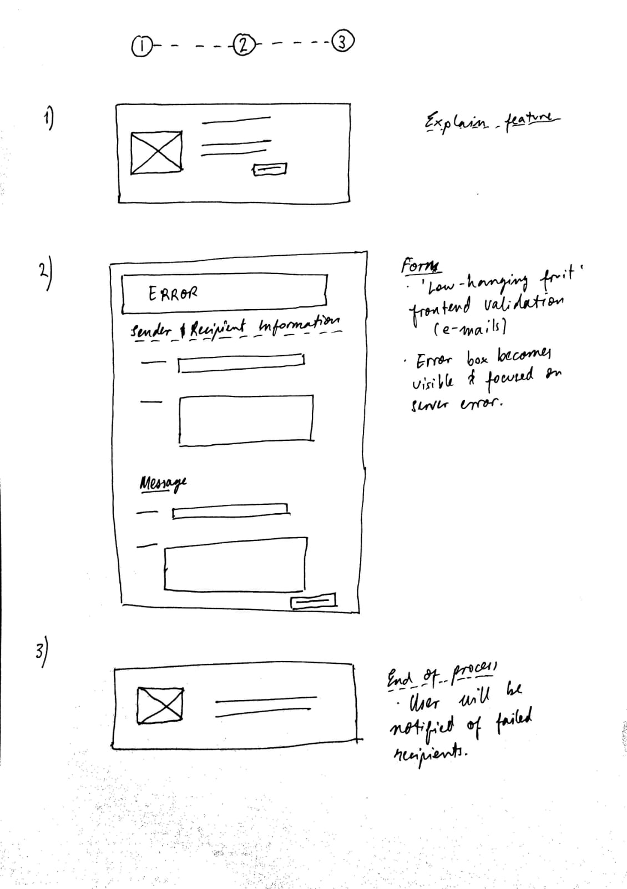
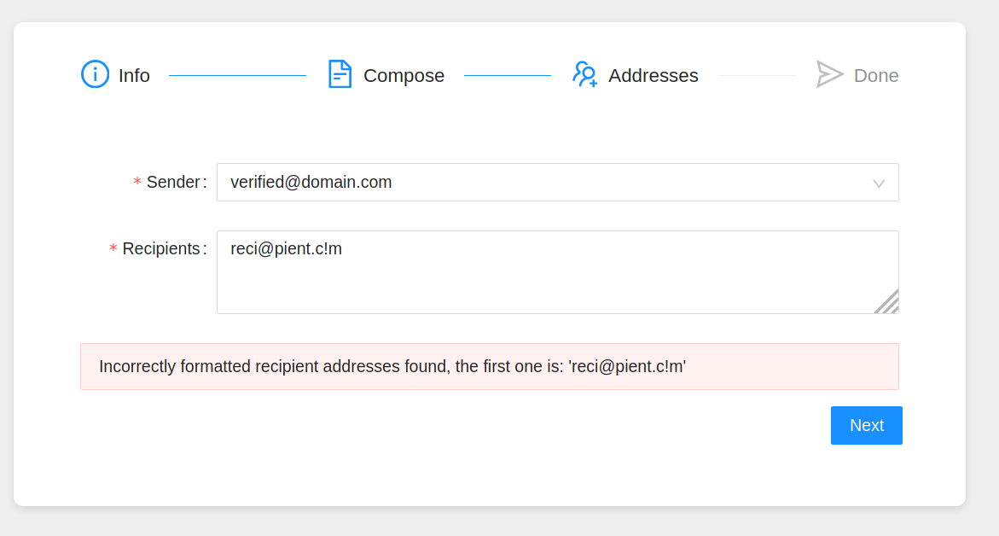
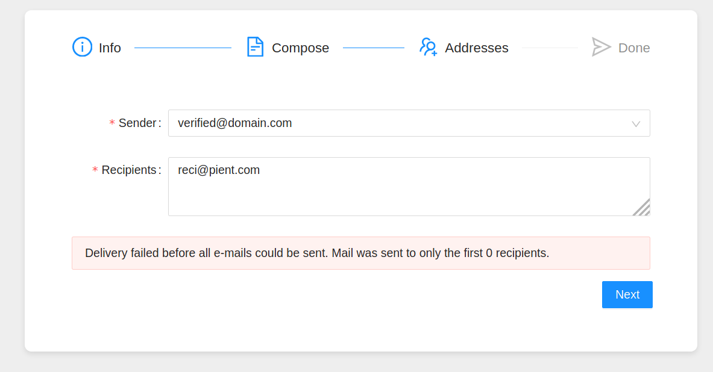

## UPDATE: Interview Feedback

The design and architecture were well-received in the interview. Two senior developers were very generous with their time and knowledge and suggested some changes in the implementation that would help scalability and readability of the code:
* Better error handling through custom exceptions.
* Open a session and re-use it for all requests with the same provider.
* Use a superclass and a factory method instead of standalone function for the mailers recipient batching.
* Use a queue and a pool to make better use of computer resources.

Their ideas were, naturally, great; these are people that make python work with millions of requests per minute. So I am implementing them. I have implemented the first three points and only need to implement the pool.

This code challenge is a good opportunity to document my current workflow. I split development work into four phases: requirements, architecture & prototyping, construction & testing, deployment. This follows the classic SDLC and is a design-thinking approach which I take from 'Code Complete'

## Requirements

The wording of the problem statement is quite open-ended: a multi-user platform with scheduling and a messaging queue deployed with fault tolerance over k8s would be as acceptable a solution as a simpler solution. Since I have another coding challenge to complete and I also want to deliver a frontend, I decide to limit my solution to a minimalistic batch e-mail delivery tool without authentification, persistence, a message queue, etc.

## Architecture & Prototyping

For the backend I settled on this architecture:

(Remark: since UML lacks notation for standalone functions, I have modeled those as static methods of the 'global' class.)

For the frontend I drew this wireframe:

The definition of prototyping in the SDLC is to write the minimum amount of code necessary to clarify how to implement a certain feature. In this case, the only technical challenge was to understand how the APIs for Mailgun and Amazon SES work, so I signed up for their services and got wrote working queries using Postman. I then wrote the relevant code using the `requests` and `boto3` libraries.

## Construction & Testing

For the construction phase I implemented everything using Python for the backend and JS/React/antd for the frontend. Docstrings, comments and tests are only used when strictly necessary, following XP practice, to allow for easier extensibility.

During construction I also implemented some error handling which hadn't been well-thought out in the previous phase. There is some trivial frontend validation and otherwise errors are produced by the server and presented in an alert box:

## Deployment

In order to standardise deployment, the app was dockerized. All configuration is passed to the containers as environment variables (in the src/.env file, which can be filled out by copying the src/.env.sample file). Due to lack of time, I did not implement a production configuration, so both containers simply run their respective development servers. In production, the frontend would have to be built and served, e.g. using nginx, whereas the backend could be served by gunicorn (or Flask directly using the production configuration).
